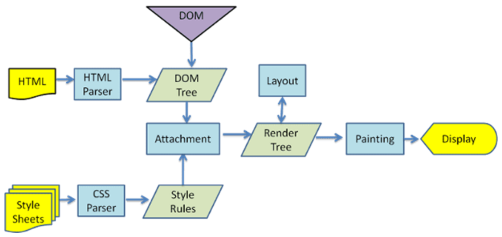

## 1- مقدمة عن الـ HTML وإيه فايدتها:

ممكن هنا نتكلم عن فايدة الـ `HTML` في حياتنا كديفيلوبر هي واحدة من أهم الحاجات اللي بنستخدمها عشان نبني هيكل أي موقع إحنا بنشوفه ونخلي المتصفحات تفهمه ومحركات البحث تفهمه وتفهم تقسيمته وتعرف تتعامل معاه إزاي.
ال `HTML` في الأساس اختصار لـ : `HyperText Markup Language`.

الـ Browser بيعدي على 4 مراحل أساسية عشان يرندر (Render) أي صفحة أو موقع إحنا بنعمله وهي:

1. مرحلة الـ `Parsing`
2. مرحلة الـ `Render`
3. مرحلة الـ `Layout`
4. مرحلة الـ `View`

في أول مرحلة (الـ `Parsing`) المتصفح بياخد كود الـ `HTML` اللي إحنا كتبناه وبيحوله لحاجة اسمها `DOM Tree`.

الـ `DOM Tree` عبارة عن تقسيمة على شكل شجرة بتوضح هيكل الصفحة، وهي دي اللي بتعرف المتصفح إزاي يبني ويرندر الصفحة خطوة بخطوة.

عندي بقى نوعين من هياكل الصفحة اسمهم الـ `Semantic` والـ `Non-Semantic` (أو الـ `Structural`).

ببساطة عشان نسهل على المتصفح بناء الـ `DOM Tree` بشكل صح، طريقة كتابتنا للتاجات بنقسمها لنوعين:

1- **الـ Semantic structure:** ودي التاجات اللي ليها معنى واضح للمتصفح ولمحركات البحث، زي مثلاً تاج الـ `<header>` والـ `<nav>` والـ `<main>` والـ `<footer>`. ودي لما بنستخدمها بنخلي البراوزر أو المتصفح يفهم معنى المحتوى ويرندره بشكل صح.

2- **الـ Non-Semantic:** دي بقى التاجات اللي ملهاش معنى زي الـ `
` والـ ``، وبيبقى نوع سيئ لمحركات البحث والمتصفح مش بيفهمها صح زي الـ `Semantic`.

## 2- إيه أشهر التاجات اللي إحنا بنستخدمها؟

### 1- في عندنا نوع للنصوص وللعناوين زي:

- الـ `<h1>` لحد الـ `<h6>`: دول بنستخدمهم عشان أكتب عناوين رئيسية وفرعية، والـ `<h1>` هو الكبير وبيتكتب مرة واحدة في الصفحة، والـ `<h6>` هو الصغير وممكن يتكرر عادي.
- الـ `
`: بنستخدمها عشان نكتب الفقرات أو النصوص العادية، وهي اختصار لكلمة paragraph.
- الـ ``: بستخدمه لو عايز أعمل تمييز أو أنسق جزء معين داخل نفس السطر.
- الـ `<strong>`: ده إحنا بنستخدمه عشان نخلي النص عريض وليه أهمية ومعنى عند محركات البحث، غير تاج الـ `<b>` ← بيخلي النص عريض بس.

### 2- في عندنا بردوا للروابط والصور:

- الـ `<a>`: بنستخدمه عشان لو عايزين نعمل رابط بيوجهني للينك أو بيوجهني لسكشن في الصفحة، وعنده attribute اسمه `href="#"`.
- الـ ``: بستخدمه عشان أعرض الصور في الموقع، ولازم نستخدم معاه الخاصية `src` عشان أحدد مسار الصورة، والخاصية `alt` لكتابة وصف بديل للصورة.

### 3- القوائم (Lists):

- الـ `<ul>`: بستخدمها عشان أعمل قائمة غير مرتبة بتظهر على شكل نقط.
- الـ `<ol>`: بستخدمها عشان أعمل قائمة مرتبة بتظهر على شكل أرقام أو حروف.
- الـ `<li>`: ده بقى اللي بنستخدمه عشان نكتب فيه الكلام اللي جوه الليست المرتبة أو الغير مرتبة.

### 4- الجداول `<table>`:

موجود جواه `<thead>`, `<tbody>`, `<tfoot>`

- الـ `<table>`: دي الحاوية الأساسية عشان أعمل أي جدول.
- الـ `<tr>`: ده بستخدمه عشان أعمل صف جديد في الجدول.
- الـ `<th>`: ده بستخدمه عشان أكتب خلايا العناوين.
- الـ `<td>`: ده بستخدمه عشان أكتب الداتا اللي في خلايا الجدول.

عشان نتحكم في حجم الخلايا وندمجهم مع بعض (زي فكرة الـ Merge Cells في الإكسيل)، بنستخدم خاصيتين مهمين جداً جوه الـ `<td>` أو الـ `<th>`:

- الـ `colspan`: دي خاصية بتخلي الخلية تتمد بالعرض وتاخد مساحة أكتر من عمود جنب بعض، مثلاً `colspan="2"` بتخلي الخلية تاخد مساحة عمودين.
- الـ `rowspan`: دي بقى بتخلي الخلية تتمد بالطول وتاخد مساحة أكتر من صف تحت بعض، مثلاً `rowspan="3"` بتخلي الخلية تنزل وتاخد مساحة 3 صفوف فوق بعض.

### 5- النماذج (Forms):

- الـ `<form>`: دي الحاوية اللي بنجمع بيها كل البيانات اللي هنبعتها للسيرفر.
- الـ `<input>`: حقل إدخال البيانات وبيتغير شكله ووظيفته بناء على خاصية الـ `type` (مثل: text, email, password, radio, checkbox).
- الـ `<label>`: بنستخدمه كعنوان أو وصف لحقل الإدخال، وبنربطه بالـ `<input>` الخاص بيه عشان نحسن تجربة المستخدم.
- الـ `<button>`: زرار بنقدر نستخدمه إن إحنا نبعت بيه داتا أو نعمل بيه أي وظيفة تانية نقدر نخصصهاله.
- الـ `<fieldset>`: بنستخدمها عشان نعمل شكل الفورم وبيجي معاها `<legend>` عشان نحدد عنوان الفورم.

### 6- حاويات التقسيم (Block vs Inline Elements)

عشان نقسم الصفحة صح، لازم نفهم إن العناصر في HTML نوعين:

- **عناصر البلوك (Block Elements):** دي عناصر طماعة بتاخد عرض السطر كله لنفسها ولما بتكتب عنصرين بلوك بيجوا تحت بعض.
    - الـ `
`: ده أشهر عنصر Block، وهو مجرد صندوق أو حاوية بنجمع فيها شوية عناصر مع بعض عشان نقسم الصفحة أو نديها تنسيق CSS معين.
    - (أمثلة تانية: `
`, `<h1>`, `<ul>`).
- **عناصر الإنلاين (Inline Elements):** دي عناصر قنوعة بتاخد مساحة على قد حجمها بس، وينفع جداً تيجي جنب بعضها في نفس السطر أو وسط الكلام.
    - الـ ``: ده أشهر عنصر Inline بنستخدمه عشان نميز كلمة أو جملة جوه سطر من غير ما نكسر السطر.
    - (أمثلة تانية: `<a>`, ``, `<strong>`).

### 8- الوسائط المتعددة (Media)

- الـ `<audio>`: بنستخدمه عشان نضيف ملفات صوت للموقع ومهم جداً نكتب معاه خاصية `controls` عشان يظهر للزائر زراير التشغيل وتعلية الصوت.
- الـ `<video>`: بنستخدمه عشان نعرض فيديوهات في الصفحة وبياخد خاصية `src` عشان نحدد مسار الفيديو، وكمان `controls` عشان زراير التشغيل.

### 9- ترتيب وتنسيق النماذج (Forms Advanced)

جوه الـ `<form>` أحياناً بنحتاج نرتب المدخلات:

- الـ `<fieldset>`: بنستخدمها عشان نجمع حقول الإدخال المرتبطة ببعضها (زي بيانات التواصل مثلاً) وبيعمل حواليها إطار أو برواز.
- الـ `<legend>`: ده التاج اللي بنكتبه جوه الـ `<fieldset>` مباشرةً، ووظيفته إنه يكتب عنوان أو اسم للإطار ده عشان يوضح للمستخدم القسم ده بتاع إيه.

### 10. إعدادات الصفحة الأساسية (Head & Doctype)

أي صفحة HTML لازم تبدأ بشوية إعدادات أساسية بتفهم المتصفح هو بيتعامل مع إيه، والبيانات دي بتتحط فوق خالص:

- `ال<!DOCTYPE html>`: ده مش تاج بالمعنى الحرفي، ده سطر بنكتبه في أول ملف الـ HTML خالص عشان نقول للمتصفح خلي بالك إحنا بنستخدم أحدث إصدار من اللغة وهو HTML5.
- `ال <head>`: ده يعتبر  عقل الصفحة، بنحط جواه كل الإعدادات والميتا داتا اللي مش بتظهر للمستخدم بشكل مباشر على الشاشة.
- `ال <title>`: ده التاج اللي بنكتب فيه عنوان الموقع وهو اللي بيظهر في التاب بتاع المتصفح من فوق.
- `ال <meta charset="UTF-8">`: ده التاج المسؤول عن الـ Encoding ووظيفته مهمة جدا لأنه بيفهم المتصفح إنه يدعم كل الحروف واللغات خصوصاً العربي عشان الكلام ميظهرش برموز غريبة ومكسرة.
- `ال <meta name="description">`: ده بنكتب جواه وصف مختصر للموقع وده مهم جدا لمحركات البحث SEO لأن ده الوصف اللي بيظهر تحت لينك موقعك في نتايج بحث جوجل.

### 11. أشهر أنواع حقول الإدخال (Input Types)

زي ما قلنا عنصر الـ `<input>` جوه النماذج (Forms) بيتغير شكله ووظيفته حسب قيمة خاصية الـ `type` اللي بنديها له ودي أشهر الأنواع:

- `ال type="text"`: ده النوع الافتراضي وبنستخدمه لإدخال نصوص قصيرة عادية (زي الاسم).
- `ال type="email"`: مخصص لكتابة الإيميلات  وبيخلي المتصفح يراجع هل اللي اتكتب ده إيميل حقيقي (فيه علامة @) ولا لأ.
- `ال type="password"`: مخصص لكلمات السر وبيخفي الكلام اللي بيتكتب (بيخليه نجوم أو نقط) عشان الأمان.
- `ال type="radio"`: بيعمل زرار دائري وبنستخدمه لو عايزين المستخدم يختار حاجة  واحدة بس من مجموعة اختيارات (زي ذكر / أنثى).
- `ال type="checkbox"`: بيعمل مربع اختيار  وبنستخدمه لو عايزين نسمح للمستخدم يختار أكتر من إجابة في نفس الوقت (زي الهوايات).
- `ال type="date"`: بيظهر للمستخدم نتيجة (Calendar) عشان يختار منها تاريخ معين بسهولة.
- `ال type="number"`: بيخلي الحقل يقبل أرقام بس.
- `ال type="submit"`: بيتحول لزرار وظيفته إرسال كل البيانات اللي اتكتبت في الفورم دي للسيرفر.
- `ال type="tel"`: مخصص لإدخال أرقام التليفونات ولما بتفتحه من الموبايل بيظهرلك لوحة الأرقام (Numpad) على طول عشان يسهل عليك.
- `ال type="file"`: بيعمل زرار يسمح للمستخدم إنه يرفع ملف من جهازه (زي صورة شخصية أو CV).
- `ال type="color"`: بيفتح للمستخدم باليتة ألوان (Color Picker) يختار منها لون معين.
- `ال type="range"`: بيعمل شريط تمرير (Slider) نقدر نسحبه يمين وشمال عشان نختار رقم في رينج معين (زي لما بنوطي ونعلي الإضاءة).
- `ال type="reset"`: زرار وظيفته إنه يمسح كل البيانات اللي المستخدم كتبها في الفورم ويرجعها فاضية زي ما كانت.

### 12. إدخال النصوص الطويلة والقوائم (Textarea & Dropdowns)

مش كل الإدخال بيكون سطر واحد، أحياناً بنحتاج مساحات أكبر أو قوائم معقدة:

- `ال <textarea>`: بنستخدمه لما نكون عايزين المستخدم يكتب كلام كتير (زي رسالة، أو مقال، أو تعليق). بيفرق عن الـ input العادي إنه بيسمح بالكتابة في كذا سطر  وبنتحكم في حجمه بخصائص زي `rows` (عدد السطور) و `cols` (العرض).
- `ال <select>` و `<option>`:
    - `ال <select>`: هي الحاوية الأساسية اللي بتعملنا قايمة منسدلة (Drop-down Menu).
    - `ال <option>`: دي بقى الاختيارات نفسها اللي جوه القايمة، وكل `option` بيكون ليه قيمة (`value`) بتتبعت للسيرفر.
- `ال <optgroup>`: اختصار لـ Option Group. لو القايمة المنسدلة بتاعتنا طويلة جداً  بنستخدم التاج ده عشان نقسم الـ `<option>` لمجموعات مرتبة (مثلاً مجموعة للبلاد العربية، ومجموعة للبلاد الاجنبية) عشان نسهل على المستخدم يلاقي اللي هو عايزه.
- `ال <datalist>`: ده تاج  بيعملنا قايمة اقتراحات (Autocomplete). بنربطه بـ `<input>` عادي جداً  ولما المستخدم يبدأ يكتب أول حرف، الـ `<datalist>` بيطلعله اقتراحات مطابقة للي بيكتبه يختار منها ولو ملقاش اللي هو عايزه يقدر يكمل كتابة عادي جدا كأنه حقل نصي طبيعي.

### 13. الصور والرسومات التوضيحية (Figure & Figcaption)

عشان نربط أي صورة بالوصف بتاعها بشكل صحيح برمجيا (Semantic)، بنستخدم التاجات دي مع بعض:

- `ال <figure>`: دي حاوية (Container) بنستخدمها عشان نجمع جواها أي محتوى مرئي مهم في الصفحة  زي صورة، رسم بياني، أو حتى كود.
- `ال <figcaption>`: اختصار لـ Figure Caption، وده تاج بنكتبه جوه الـ `<figure>` (سواء فوق الصورة أو تحتها) عشان نكتب وصف دقيق أو تعليق على الصورة دي.

العلاقة بينهم:

الـ `<figure>` بيلم الصورة (``) والتعليق بتاعها (`<figcaption>`) في باكدج واحدة كده المتصفح ومحركات البحث بيفهموا فورا إن النص ده مش مجرد كلام عشوائي، لأ ده وصف يخص الصورة دي بالذات، وده بيحسن جدا من الـ SEO بتاع الموقع.

### 14. أهم عناصر الهيكل ذات المعنى (Semantic Elements)

زي ما اتفقنا في الأول، عناصر الـ Semantic هي تاجات بتشرح نفسها وبنستخدمها بدل ما نملى الصفحة بـ `
` ملوش معنى. أهم التاجات دي اللي بتبني هيكل الصفحة الأساسي:

- `ال <header>`: بنستخدمه عشان نحدد الـ  رأس بتاع الصفحة أو القسم وغالباً بيكون فيه اللوجو وعنوان الموقع.
- `ال <nav>`: اختصار لـ Navigation وده المكان اللي بنحط فيه روابط التنقل الأساسية بتاعة الموقع (زي الرئيسية، من نحن، اتصل بنا).
- `ال<main>`: ده الحاوية اللي بتضم المحتوى الأساسي والفريد للصفحة والمفروض ميتكررش غير مرة واحدة بس في الصفحة كلها.
- `ال<section>`: بنستخدمه عشان نقسم الصفحة لأجزاء كبيرة كل جزء بيتكلم عن موضوع معين (زي قسم الخدمات، أو قسم آراء العملاء).
- `ال<article>`: ده بنحط جواه محتوى مستقل بذاته يعني لو أخدناه بره الموقع هيبقى ليه معنى لوحده (زي مقالة في مدونة، أو بوست على السوشيال ميديا، أو منتج).
- `ال<aside>`: بنستخدمه للمحتوى الجانبي اللي ليه علاقة غير مباشرة بالمحتوى الأساسي (زي شريط الإعلانات اللي في الجنب، أو لينكات مقالات مشابهة).
- `ال<footer>`: ده بنستخدمه في اخر الصفحة اللي بيكون تحت خالص وبنحط فيه غالبا حقوق النشر (Copyrights)، ولينكات السوشيال ميديا، ومعلومات التواصل.

### 15. الرموز الخاصة (HTML Entities)

أحياناً بنحتاج نكتب رموز في الموقع (زي علامة الأصغر من `<` أو الأكبر من `>`) بس المتصفح بيفتكرها بداية أو نهاية تاج HTML وبيبوظ الدنيا هنا بيجي دور الـ Entities وهي عبارة عن أكواد بنكتبها عشان المتصفح يطبع الرمز كـ نص عادي مش ككود:

- `ال &lt;`: بتطبع علامة أصغر من (<) (اختصار لـ Less than).
- `ال &gt;`: بتطبع علامة أكبر من (>) (اختصار لـ Greater than).
- `ال&amp;`: بتطبع علامة (&) (Ampersand).
- `ال&copy;`: بتطبع علامة حقوق النشر (©).
- `ال&nbsp;`: اختصار لـ Non-Breaking Space ودي بنستخدمها لو عايزين نعمل مسافة إجبارية بين الكلمات لأن الـ HTML العادي بيتجاهل المسافات الزيادة اللي بنعملها بالمسطرة (Spacebar).